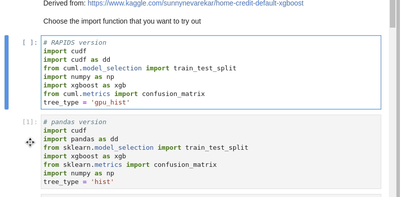
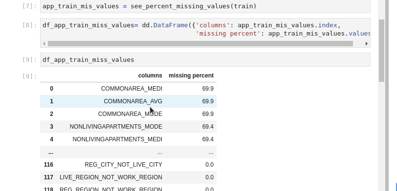
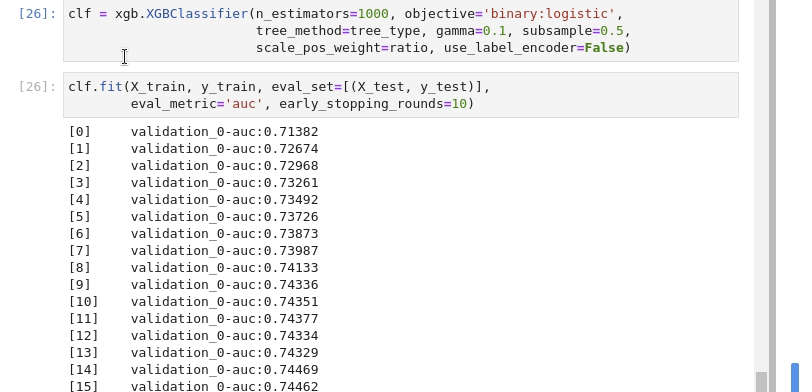
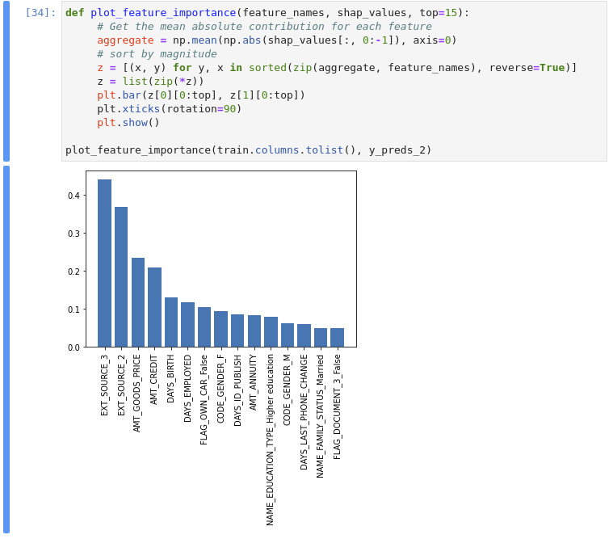
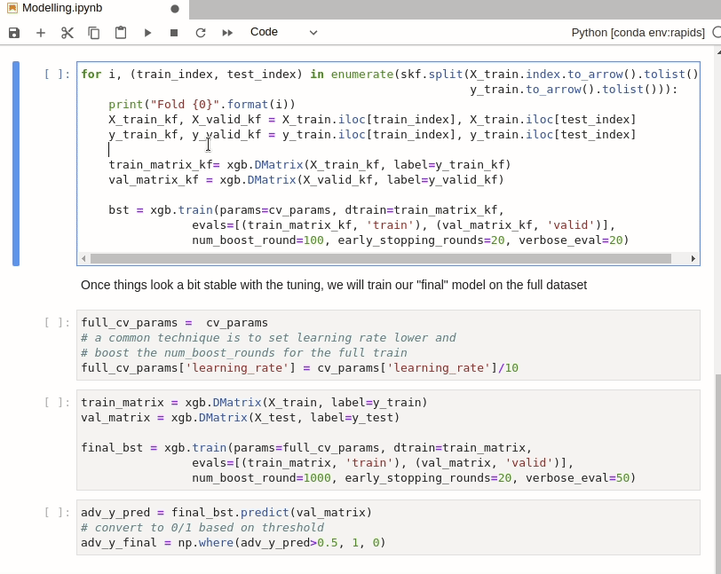

# RAPIDS.ai on Cloudera CML

In this article, we will cover leveraging RAPIDS to accelerate your machine learning projects on Cloudera's CML Platform

## Introduction

In the previous blog post in this series, we walked through the steps for leveraging Deep Learning in your Cloudera Machine Learning (CML) projects. As a aprt of our partnership with NVIDA, we now also include a RAPIDS engine which comes preconfigured with all necessary libraries to bring the power of RAPIDS to your projects.

## What is RAPIDs

Rapids is a series of libraries from NVIDIA that bring the power of GPU compute to standard Data Science operations, be it exploratory data analysis, feature engineering or model building. For more information see: <https://medium.com/rapids-ai>. The RAPIDS libraries are designed as drop in replacements for common Python data science libraries like cudf (pandas), cupy (numpy), cuml (sklearn) and dask_cuda (dask). By leveraging the parallel compute capacity of GPUs the time for complicated data engineering and data science tasks can be dramatically reduced accelerating the timeframes for Data Scientists to take ideas from concept to production.
## Scenario

In this tutorial, we will illustrate how RAPIDS can be used to tackle the Kaggle Home Credit Default Risk challenge. The Home Credit Default Risk problem is about predicting the chance that a customer will default on a loan, a common financial services industry problem set. To try and predict this, an extensive dataset including anonymised details on the individual loanee and their historical credit history are included. See https://www.kaggle.com/c/home-credit-default-risk/overview for more details.

As a machine learning problem, it is a classification task with tabular data, a perfect fit for RAPIDs.

The focus of this tutorial will be on the mechanics of leveraging the RAPIDs library and not on building the best performing model for the leaderboard. To see more information on the winning submission See: https://www.kaggle.com/c/home-credit-default-risk/discussion/64821

## Project Setup

To follow along, clone the repo at: https://github.com/Data-drone/cml_rapids.git into a new CML Project. 


In this example we will a Jupyter Notebook session to run our code. Create a session like so:


## Get the Dataset

For the code to work, the data in it's CSV format should be placed into the data subfolder. The dataset can be downloaded from: https://www.kaggle.com/c/home-credit-default-risk/data


To validate that our image is working and that RAPIDS is correctly configured, run `testing.py` from a terminal session in jupyterlab.

You should see:


Common problems at this stage can be related to GPU versions. RAPIDS is only supported on newer NVIDIA gpus. For AWS this means at least P3 instances. P2 GPU instances are not supported.

### Data Ingestion

TODO - Do we need to create a requirements.txt for installing libs?

The raw data is in a series of CSV files. We will firstly convert this to parquet format. Run the `convert_data.py` script. This will open the csvs with correctly data types then save them out as parquet in the `raw_data` folder. 


Exploring the dataset, there are numerical columns, categorical and boolean columns. 

### Simple Exploration and Model

Lets start with a simple model to start.
Open `A_First_Model.ipynb`

At the start of this notebook, you can choose which set of libraries to load.
The RAPIDs set or the Pandas set. Just run one of these cells.


This notebook goes through loading just the train and test datasets


Some simple filtering out of columns with a lot of missing values


It is worth noting that although RAPIDS `cudf` is mostly a drop in replacement for `pandas`, we do need to change some parts to make it work seamlessly.

```python
if type(df_app_train_miss_values) == cudf.core.dataframe.DataFrame:
    drop_columns = df_app_train_miss_values[df_app_train_miss_values['missing percent'] \
                                        >= 40]['columns'].to_arrow().to_pylist()
else:
    drop_columns = df_app_train_miss_values[df_app_train_miss_values['missing percent'] \
                                        >= 40]['columns'].tolist()
```

The training of the model


And analysis of the results.


From our testing, the RAPIDS accelerated pipeline is ~28% faster.
### Feature Engineering

Now that we have a feel for how this works, lets look at a more advanced feature engineering pipeline.
For our simple feature engineering pipeline, we only used the main training table and didn't look at the other tables in the dataset.

For our advanced feature engineering pipeline, we will include some of this auxiliary data and also engineering some additional features.

Open the Comparing_Frameworks.ipynb file to see compare how cudf and pandas compare.

    NOTE: The function for engineering the features have been written to be compatible with Pandas and cuDF and can be found in `feature_engineering_2.py` 

The notebook is split into two sections. RAPIDS cuDF and Pandas.
From our testing, we see the followin in terms of performance:

| Process        | RAPIDS (wall time) | Pandas (wall time)  |
| ------------- |:-------------:| :-----:|
| Ingest Data      | 1.9 secs | 5.05 secs |
| Generate Features      | 2.39 secs | 10.3 secs |
| Write Data | 621 ms | 2.28 secs |

We can see that for all parts of the process, RAPIDs offers higher performance than raw Pandas. It is worth noting at this stage, that RAPIDs cuDF can only take advantage of one GPU. Should we wish to scale beyong a single GPU, we will need to leverage `dask_cudf`.

Moving to Dask requires moving to a clustered architecture and refactoring the code to work within the constraints of the dask dataframe. Whilst most Pandas APIs will transfer seamlessly to Dask, there are notable exceptions. See https://docs.dask.org/en/latest/dataframe.html for more information. Given the added complexity we will save this for a future discussion.

### Modelling

For the advanced modelling section, we will again leverage xgboost as our primary method. To enable GPU Acceleration, we set the `tree_method` to `gpu_hist`. That is really all we need to do to leverage GPU compute!


With the Home Credit Default Risk Challenge, overfitting is very easy. So we have included a cross validation step here. In order to use `train_test_split` with RAPIDS cudf frames, we use the `cuml` version instead. cuML, however, doesn't have `StratifiedKFold` sampling so we will use the `sklearn` version.

`StratifiedKFold` isn't very computationally expensive however so it doesn't matter that we aren't running this on GPU. The resulting indexes can also be used directly with cudf dataframes via `iloc` as per normal.



### Accessing Models

With our model trained, we can have a look at the confusion matrix and auc scores from our model. Again, we use cuml versions so that we don't have to transfer the data back to CPU.


## TODOS

- can also explore porting to dask-cudf
